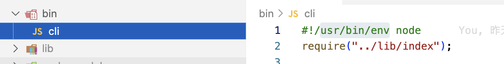

# 序

**为什么要自己搭建项目 ？**

这个事情起始于前两天给团队写一个脚手架工具，这段时间刚做做完一个系统，是团队第一个正式意义上的全栈项目；团队有自己的前端脚手架，但是没有后端脚手架，所以想着给团队写一个后端脚手架工具，这样团队在开展后续的全栈项目时可以使用脚手架构建项目，避免了重复搭建项目初始架构的大量工作，成员直接编写业务代码即可。
前两天用 JavaScript 完成了脚手架的初版，开发过程中发现没一点代码提示，很不舒服，而且这样的代码不利于后续的迭代和维护。
所以决定用 typescript 重构一遍，但是官方好像没有提供一个合适的脚手架工具，于是就开始自己搭建 typescript 项目；自己搭建最大的好处就是 自主可控，项目中集成了实时编译的开发环境、eslint + prettier 保证代码质量和风格统一、项目构建工具、git 提交信息的规范化，这些都是一个项目最基本和必要的配置。
本来到这里就结束了，但是在后续重构脚手架的过程中发现一个问题，如果每写一个新的 typescript 项目就重复一遍这个搭建流程，比如：今天需要开发一个 npm 包，明天需要开发另外一个脚手架，这好像有点太麻烦了，于是就把整个搭建过程写成了一个脚手架，这样在后续开发的工作中就可以实现一键创建项目，简单、方便、舒爽

## 搭建项目

### 1、初始化项目

```
mkdir ts-project && cd ts-project && npm init -y && npm i typescript -D && npx tsc --init
```

这条命令的意思是在当前目录下创建一个 ts-project 目录，然后进入 ts-project 目录执行 npm init -y 初始话目录产生 package.json 文件，之后运行 npm i typescript -D 在开发环境安装 typescript 包，之后执行 npx tsc --init 生成 tsconfig.json 文件。

```
mkdir src && touch src/index.ts
```

新建 src 目录作为项目的源码目录（开发目录），并在 src 目录下创建 index.ts 文件作为项目的入口文件

### 2、设置 tsconfig.json

如果一个目录下存在 tsconfig.json 文件，那就意味着这个目录是 typescirpt 项目的根目录，tsconfig.json 文件中指定了用来编译项目的根文件和编译选项，使用 tsc --init 生成的 tsconfig.json 文件包含了大量的选项，其中大部分都被注释掉了，一般我们只需要配置如下内容即可

```json
{
  "compileOnSave": true,
  "compilerOptions": {
    "target": "ES2018",
    "module": "commonjs",
    "moduleResolution": "node",
    "experimentalDecorators": true,
    "emitDecoratorMetadata": true,
    "inlineSourceMap": true,
    "noImplicitThis": true,
    "noUnusedLocals": true,
    "stripInternal": true,
    "pretty": true,
    "declaration": true,
    "outDir": "lib",
    "baseUrl": "./",
    "paths": {
      "*": ["src/*"]
    }
  },
  "exclude": ["lib", "node_modules"]
}
```

### 3、下载@types/node

```
npm i ts-node-dev -D
```

在 package.json 的 scripts 中增加如下内容

```json
 "scripts": {
    "build": "rm -rf lib && tsc --build",
    "start": "ts-node-dev --respawn --transpile-only src/index.ts sr",
    "test": "echo \"Error: no test specified\" && exit 1"
  },
```

执行 npm run start 即可启动开发环境，并且修改文件时可实时编译。

好了，到这里项目就搭建好了，虽然还有一些可优化和扩展的地方，但是用于开发一个简单的 npm 包或者脚手架的项目来说已经足够了，如有需要可以基于以上内容再进行进一步的补充和扩展，希望大家能从里面得到自己需要的内容。

## 脚手架准备工作

**常用工具包**

```
"chalk": "^4.1.0",  // 粉饰你的终端，给你的终端文字添加样式
"clear-console": "^1.1.0", // 清空命令行的当前界面，类似于浏览器控制台的 clear() 和 命令行下的 clear
"commander": "^6.2.0", // 完整的 node.js 命令行解决方案
"download-git-repo": "^3.0.2", // 让你可以使用 node.js 从 git 仓库下载代码，不过我这里下了gitlab有问题，我用的其他方法
"inquirer": "^7.3.3", // 通用交互式命令行用户界面，收集用户的选择
"ora": "^5.4.1" //进一步丰富你的命令行，支持添加一些图标、动效loading
```

## 本地调试

在项目根目录下的 pacakge.json 中增加如下内容：

```
"bin": {
    "hxgy-create-app": "./bin/cli"
  },
```

bin 表示命令(ts-cli)的可执行文件的位置，接下来在项目根目录执行 npm link，将 package.json 中的属性 bin 的值路径添加全局链接，在命令行中执行 ts-cli 就会执行 ./bin/ts-cli.js 文件
当用户安装带有 bin 字段的包时，如果是全局安装，npm 将会使用符号链接把这些文件链接到/usr/local/node_modules/.bin/(即全局的 node_modules/.bin 中)；如果是本地安装，会链接到./node_modules/.bin/。
开发结束可执行 npm unlink ts-cli 去掉 ts-cli 的链接，如果不幸你执行 npm link 命令之后你改变了你的目录名，在 unlink 时会无效，只能手动去全局的 node_modules 中删除对应的软连接
在项目根目录下添加 bin 目录，然后在 bin 目录下新建 ts-cli.js，文件内容如下：

```
#!/usr/bin/env node
require("../lib/index");
```



## /src/index.ts

```ts
import { program } from "commander";
import create from "./order/create";
import chalk from "chalk";

const pkg = require("../package.json");
program
  .version(pkg.version, "-v --version")
  .name(pkg.name)
  .option("-f, --framework", "指定创建项目的框架，目前只支持Vue")
  .usage("<app-name> [options]");
program
  .arguments("<app-name>")
  .description(`${chalk.cyan("创建项目 => hxgy-create-app ProjectName")}`)
  .action(async (name: string) => {
    await create(name);
  });

program.parse(process.argv);
```

## /src/order/create.ts

```ts
import {
  changePackageInfo,
  end,
  isFileExist,
  selectFeature,
} from "../utils/create";
import chalk from "chalk";
import { download } from "./download";

// create 命令
export default async function create(projecrName: string): Promise<void> {
  try {
    // 判断文件是否已经存在
    isFileExist(projecrName);
    // 选择版本
    const feature = await selectFeature();
    download({ projecrName, feature });
    changePackageInfo(projecrName);
    end(projecrName);
  } catch (err) {
    console.log(chalk.red(err));
  }
}
```

## /src/order/download.ts

```ts
import ora from "ora";
import { red } from "chalk";
// import downloadGitRepo from 'download-git-repo';

const child_process = require("child_process");
const { execSync } = child_process;

interface GitRepoProps {
  projecrName: string;
  feature: string;
}

const VersionTypeMap = new Map([
  ["ts", "git@192.168.168.19:ehospital/03-cpfh/template/hxgy-template-web.git"],
  // ['js','github:yangzongzhuan/RuoYi-Vue3']
  ["js", "https://github.com/yangzongzhuan/RuoYi-Vue3.git"],
]);
export const download = async ({ projecrName, feature }: GitRepoProps) => {
  const spinner = ora("正在拉取模版...");
  try {
    spinner.start();
    await execSync(`git clone ${VersionTypeMap.get(feature)} ${projecrName}`, {
      stdio: "inherit",
    });
    spinner.stop();
  } catch (err) {
    spinner.stop();
    console.log(red(`\n ❌   ${err}\n`));
    process.exit(1);
  }
};
```

## src/utils/common.ts

```ts
/**
 * 放一些通用的工具方法
 */
import { readFileSync, writeFileSync } from "fs";
import { resolve } from "path";
const clear = require("clear-console");

export interface PackageJSON {
  name: string;
  version: string;
  description: string;
  scripts: {
    [key: string]: string;
  };
}

export interface JSON {
  [key: string]: unknown;
}

/**
 * 读取指定路径下 json 文件
 * @param filename json 文件的路径
 */
export function readJsonFile<T>(filename: string): T {
  return JSON.parse(readFileSync(filename, { encoding: "utf-8", flag: "r" }));
}

/**
 * 覆写指定路径下的 json 文件
 * @param filename json 文件的路径
 * @param content  json 内容
 */
export function writeJsonFile<T>(filename: string, content: T): void {
  writeFileSync(filename, JSON.stringify(content, null, 2));
}

/**
 * 获取项目绝对路径
 * @param projectName 项目名
 */
export function getProjectPath(projectName: string): string {
  return resolve(process.cwd(), projectName);
}

/**
 * 打印信息
 * @param msg 信息
 */
export function printMsg(msg: string): void {
  console.log(msg);
}

/**
 * 清空命令行
 */
export function clearConsole(): void {
  clear();
}
```

## src/utils/create.ts

```ts
/**
 * create 命令需要用到的所有方法
 */
import {
  getProjectPath,
  PackageJSON,
  printMsg,
  readJsonFile,
  writeJsonFile,
  clearConsole,
} from "../utils/common";
import { existsSync } from "fs";
import { prompt } from "inquirer";
import { blue, cyan, gray, red, yellow } from "chalk";

/**
 * 验证当前目录下是否已经存在指定文件，如果存在则退出进行
 * @param filename 文件名
 */
export function isFileExist(filename: string): void {
  // 文件路径
  const file = getProjectPath(filename);
  // 验证文件是否已经存在，存在则推出进程
  if (existsSync(file)) {
    printMsg(red(`${file} 已经存在`));
    process.exit(1);
  }
}

/**
 * 交互式命令行，让用户自己选择需要的功能
 * return string
 */
export async function selectFeature(): Promise<string> {
  // 清空命令行
  clearConsole();
  // 输出信息
  printMsg(blue(`TS CLI v${require("../../package.json").version}`));
  printMsg("开始初始化项目:");
  printMsg("");
  const { feature } = await prompt([
    {
      name: "feature",
      type: "list",
      message: "请选择项目类型",
      choices: [
        { name: "TypeScript", value: "ts" },
        { name: "JavaScript", value: "js" },
      ],
    },
  ]);
  return feature;
}

/**
 * 改写项目中 package.json 的 name、description
 */
export function changePackageInfo(projectName: string): void {
  const packageJSON: PackageJSON = readJsonFile<PackageJSON>(
    `./${projectName}/package.json`
  );
  packageJSON.name = packageJSON.description = projectName;
  writeJsonFile<PackageJSON>(`./${projectName}/package.json`, packageJSON);
}

/**
 * 整个项目安装结束，给用户提示信息
 */
export function end(projectName: string): void {
  printMsg("");
  printMsg("");
  printMsg(`✅ Successfully created project ${yellow(projectName)}`);
  printMsg("");
  printMsg(`${gray("$")} ${cyan("cd " + projectName)}`);
  printMsg(`${gray("$")} ${cyan("npm run dev")}`);
  printMsg("");
}
```

## 构建、发布

执行 npm run build 进行构建，修改 package.json 中的如下内容

```json
{
  "name": "@hxgy/create-app-cli",
  "version": "1.1.8",
  "description": "@hxgy/create-app-cli",
  "main": "./lib/index.js",
  "bin": {
    "hxgy-create-app": "./bin/cli"
  },
  "scripts": {
    "build": "rm -rf lib && tsc --build",
    "start": "ts-node-dev --respawn --transpile-only src/index.ts sr",
    "test": "echo \"Error: no test specified\" && exit 1"
  },
  "files": ["bin", "lib", "README.md"],
  "keywords": ["前端脚手架"],
  "author": "hongpeiLee",
  "license": "ISC",
  "dependencies": {
    "chalk": "^4.1.0",
    "clear-console": "^1.1.0",
    "commander": "^6.2.0",
    "download-git-repo": "^3.0.2",
    "inquirer": "^7.3.3",
    "ora": "^5.4.1",
    "shelljs": "^0.8.5",
    "util": "^0.12.5"
  },
  "devDependencies": {
    "@types/node": "^14.14.10",
    "ts-node-dev": "^2.0.0",
    "typescript": "^4.1.2"
  }
}
```

- name: 包名，在包名称前加自己的 npm 账户名，采用 npm scope 的方式，包目录的组织方式和普通包不一样，而且可以有效的避免和他人的包名冲突
- main：表示包的入口位置
- keywords：关键字，方面别人搜索到你的包
- files：告诉 npm，publish 时发布哪些包到 npm 仓库
- repository：项目仓库

在项目根目录下增加一个发布脚本 publish.sh

```
#!/bin/bash

echo '开始构建脚手架'

npm run build

echo '脚手架构建完成，现在发布'

npm publish --access public
```

这样子就已经完成！**完结撒花 🎉🎉🎉**
