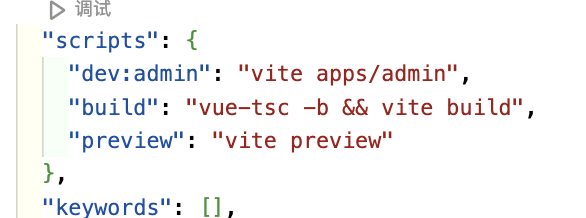
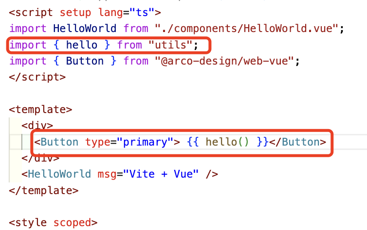

**pnpm 是什么**？

> 速度快、节省磁盘空间的软件包管理器

**monorepo 是什么？**

> monorepo 是包含多个不同项目的单个存储库，具有明确定义的关系。

**为什么需要 monorepo？**

> 当你需要同时维护多个技术栈类似的项目，而这些项目之间互相依赖的时候，使用 monorepo 会有很多好处，比如：
>
> - 项目基础设施可以统一管理，比如 eslint、prettier、tsconfig 等
> - 项目中抽离的公共代码库，在互相依赖的时候可以很方便的进行依赖管理和调试，比如 utils、api、ui 等
> - 以及使用 npm、yarn、pnpm 等包管理器可以方便的进行第三方依赖的统一管理，达到节省安装空间，提升安装速度等目的

## 1、准备工作

```
# 安装pnpm
npm install -g pnpm

1.创建一个项目文件夹:
mkdir monorepoo-project
cd monorepo-project

在项目中新建若干文件夹，搭建项目结构：
├─apps  # 应用代码目录
│  ├─admin  # 管理平台应用
│  └─portal # 门户网站应用
└─packages # 公共库
    ├─api # api管理
    ├─tsconfig # tsconfig配置
    ├─ui # 公共组件
    └─utils # 公共方法

2.在项目根目录新建文件 pnpm-workspace.yaml，写入如下代码：

# pnpm-workspace.yaml

packages:
  - "packages/*"
  - "apps/*"

3.然后进行一些初始化工作，在下面根目录初始化生成 package.json:
pnpm init

然后修改生成的 package.json：
{
  "name": "monorepo-project",
  "version": "1.0.0",
  "scripts": {},
  "devDependencies": {}
}
基础的项目目录结构以及准备工作就完成了，接下来进行编码工作，去体验一下
```

## 2、编写 Demo

```
在 packages/utils 初始化一下应用:
pnpm init

删除不需的多余的，保留如下：

{
  "name": "utils",
  "version": "0.0.0",
  "main": "./index.ts",
  "module": "./index.ts"
}

然后再新建一个文件 index.ts，写入一个测试方法

function hello(msg = "world") {
  return `hello ${msg}!`;
}

export { hello };

```

**编写 admin demo**
这里使用 vite + react 技术栈，在 apps/admin 里初始化一下应用，在 apps/admin 初始化一下应用：

```
# 可以直接创建、复制都可以
cd ./apps/portal
pnpm create vite
如果在一个已经存在的文件夹下初始化 vite 应用，可以在 Project name 的时候输入 . ，这样就以已存在的文件夹作为应用目录

将 apps/portal 生成的 package.json 里的依赖配置剪切到根目录下的 package.json，只保留基本的：
{
  "name": "portal",
  "private": true,
  "version": "0.0.0",
  "type": "module",
  "scripts": {
    "dev": "vite",
    "build": "tsc && vite build",
    "preview": "vite preview"
  }
}
到时候以来可以共用根目录下的，以达到减少依赖的作用
然后在根目录安装一下依赖，这里安装在根目录的依赖是整个项目都可以直接使用的

```

::: tips 1.依赖安装到根目录 使用 -w 参数，比如：

```
pnpm add axios -w
```

2.如果要在指定的应用中安装依赖，使用 --filter 参数，比如：

```
pnpm --filter admin add axios 或者 pnpm i axios --filter admin

#--filter 也可以指定在具体应用下执行脚本命令，比如：
# 启动 portal 应用
pnpm --filter admin dev
当然也可以用其他方法，在根目录的package.json下改写script


3.--parallel 会找项目里找所有你后边跟的脚本命令比如我们现在这个 monorepo 下有两个应用有 preview ，那这两个应用的 preview 都会运行
pnpm run --parallel dev

```

具体请查看[pnpm 中文网](https://www.pnpm.cn/cli/run)
:::

接下来把刚才写的 utils 添加到 admin 中

```
{
  "name": "portal",
  "private": true,
  "version": "0.0.0",
  "type": "module",
  "scripts": {
    "dev": "vite",
    "build": "tsc && vite build",
    "preview": "vite preview"
  },
  "dependencies": {
    "utils": "workspace:*"
  }
}

# ps: 这里名称最好和utils里面的package.json一致

# 这里的 "utils": "workspace:*" 是手动添加的，因为 npm 上是存在 utils 这个库的，
版本号写成 workspace:*，workspace 代表的是工作空间，这个在 pnpm 里有介绍，
* 是代表使用最新版本版本，不过在本项目中也不存在依赖库版本变更问题。

# 然后在项目根目录下执行依赖安装
pnpm install


#在 admin 中引入 utils，并使用我们编写的测试方法


然后改一下 utils 提供的方法 hello 输出，再看一下 admin

可以看到admin 不需要重启，utils 的修改就已经生效了，而且 utils 也不需要打包就可以引入使用
```

## 3.打包

```
# 打包
pnpm --filter portal build
# 预览
pnpm --filter portal preview
也可以配置到根目录的package.json里面
```

其他组件也是如此：


[参考](https://juejin.cn/post/7122265283451944974)
[lerna+pnpm+monorepo 的模式](https://juejin.cn/post/7290755652524048439)
