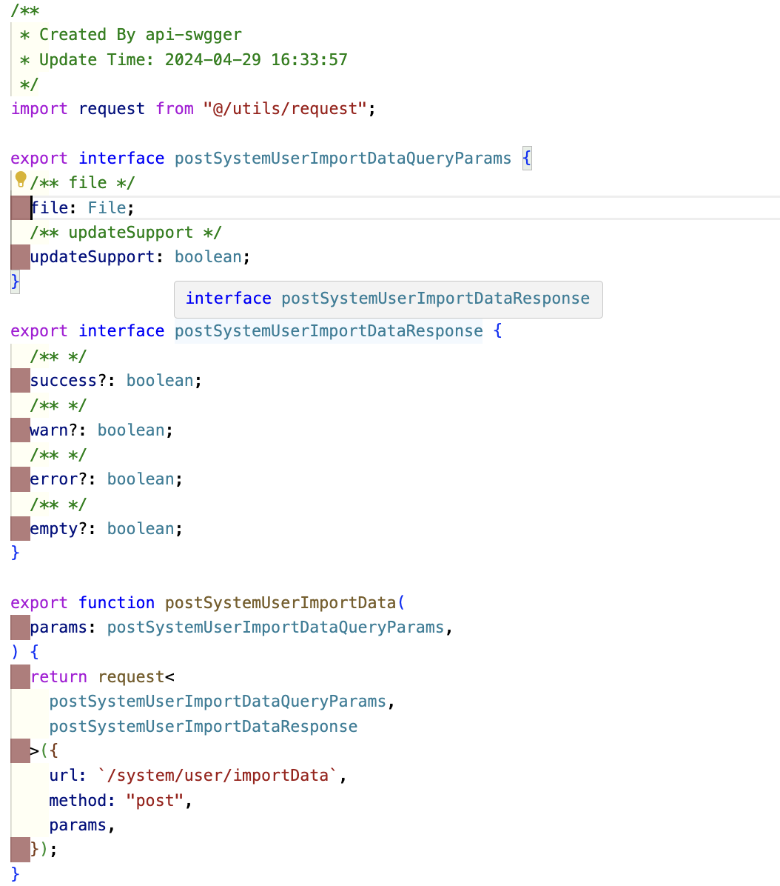

当前端 web 项目中应用了 ts，我们不可能对成千上百的接口进行 interface 的类型定义,那样效率是极低的，但是我们又需要 ts 智能友好的提示信息，该怎么办？这是我们必须要面对的问题。

## 介绍

根据 swagger.json 地址迅速生成 ts 接口，以及相关请求响应参的 interface 模块命令行工具。且支持 swagger 的 V2、V3 版本。其宗旨是利用 swagger 接口文档让前端的效率变得更高，接口的请求参、响应参以及接口命名将不在需要手动引入，让前端更聚焦在业务功能的开发，接口将全面与 swagger 进行同步。

## 快速入门

### 1、安装

```
npm i apitots-swaggers -g 或者 yarn add apitots-swaggers -g
```

全局安装能让命令在任何地方能运行，如果只安装在项目上，可执行文件将被安装到 node_modules/.bin 下，通常这个目录通常不会被加入系统的 PATH 环境变量，所以就需要在 script 内定义脚本进行运行方可成功跑通脚本，如下：

```json
"scripts": {
    "apits:init": "apits init",
    "apits:gen": "apits tots",
  }
```

全局安装则不需要，可直接运行 apits 命令，两种方式可任意选择

### 2、帮助文档

输入 apits,根据命令提示进行操作，如图:


:::warning
注意: request 需要到处 axios 的 request 类型，为 ts 提供类型,因为 request 需要接受两个类型，request、response

:::

### 3、API 说明

|        参数        |                        说明                        |  类型  |        是否必填        | 默认值  |
| :----------------: | :------------------------------------------------: | :----: | :--------------------: | :-----: |
|     serverUrl      |            服务地址，此处填其 json 地址            | string |           是           |         |
| requestInstanceUrl |             请求文件路径(request 路径)             | string |           否           |  axios  |
|   outputFilePath   |                    输出文件路径                    | string |           否           | src/api |
|   ImportBaseURL    |            设置接口的 baseURL 导入地址             | string |    否，搭配 baseURL    |         |
|      baseURL       |                 设置接口的 baseURL                 | string | 否，搭配 ImportBaseURL |         |
|    includeTags     |                   包含的接口 Tag                   | string |           否           |   []    |
|    excludeTags     |                   排除的接口 Tag                   | string |           否           |   []    |
|       prefix       | 添加前缀，如代理请求模式，所有请求均请求到指定接口 | string |           否           |         |

### 4、结果


