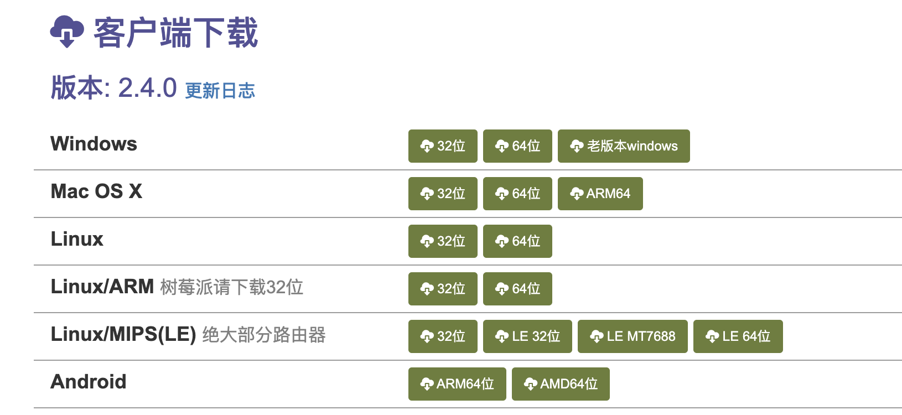
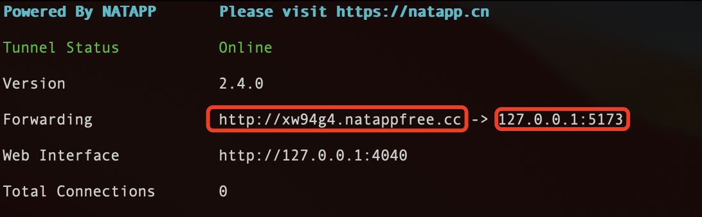

**natapp 是什么**？

‌Natapp‌ 是一个基于 ngrok 技术的内网穿透工具，允许用户将自己的内网服务暴露给外网，实现内外网通信。

**官网**

> https://natapp.cn/ > 

**购买隧道**


#### 使用

**1.下载**
下载后解压会有一个 natApp


**2.授权**
进入 natapp 所在的文件夹

```
chmod a+x natapp // 授权
## 然后运行, = 后面需要加上自己隧道生成的token（在natapp我的隧道里可以找到）
./natapp -authtoken=

ps:mac 电脑需要在电脑安全里面允许
```

框内为映射的网址


直接访问域名就可以了
